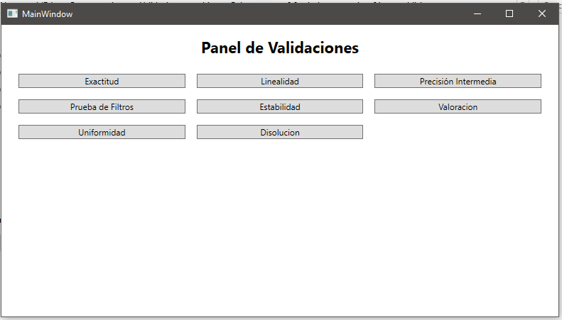
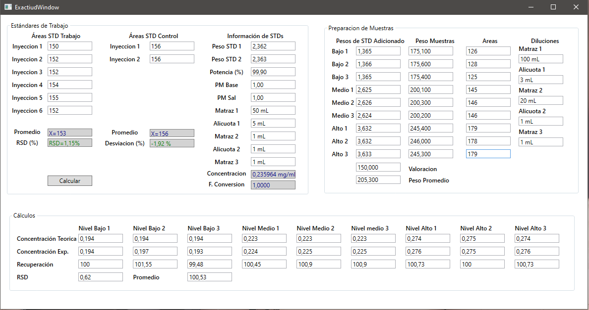

# 🧪 ValidacionesLab

Aplicación **WPF (.NET 9.0-windows)** para validaciones de laboratorio farmacéutico.  
Automatiza cálculos de **Exactitud, Recuperación (%) y RSD**, mostrando resultados con colores **PASS/FAIL** para facilitar la interpretación.

---

## 🚀 Características
- ✅ Cálculo de **Concentración Teórica** y **Experimental**.
- ✅ Cálculo automático de **Recuperación (%)** por réplica.
- ✅ **Promedio y %RSD global** de las 9 determinaciones.
- ✅ Validación visual con colores (verde = OK, rojo = fuera de rango).
- ✅ Distribución como ejecutable **self-contained** (no requiere instalar .NET).

---

## 🖼️ Capturas de pantalla

### Ventana de Exactitud

### Cálculos automáticos

*(Guarda tus screenshots en `docs/screenshots/` y renómbralos como en el ejemplo para que se muestren aquí)*

---

## 📦 Instalación
1. Descarga la última versión desde [Releases](../../releases).
2. Extrae el `.zip`.
3. Ejecuta `Validaciones.exe` (no requiere instalar .NET).

---

## 🛠️ Tecnologías utilizadas
- [C# WPF](https://learn.microsoft.com/es-es/dotnet/desktop/wpf/)
- [XAML](https://learn.microsoft.com/es-es/dotnet/desktop/wpf/xaml/)
- [.NET 9.0-windows](https://dotnet.microsoft.com/)
- [GitKraken](https://www.gitkraken.com/) para control de versiones

---

## 📑 Roadmap
- [ ] Agregar módulo de **Linealidad**
- [ ] Módulo de **Precisión intermedia**
- [ ] Reportes en PDF con gráficos
- [ ] Paquete instalador (MSIX/MSI)

---

## 👨‍🔬 Autor
Desarrollado por **Osito 🐻 + Lumi 💖**
> Nuestro hogar también vive en el código 🏡✨

---

## 📜 Licencia
Este proyecto se distribuye bajo la licencia MIT.  
Consulta el archivo [LICENSE](LICENSE) para más información.
